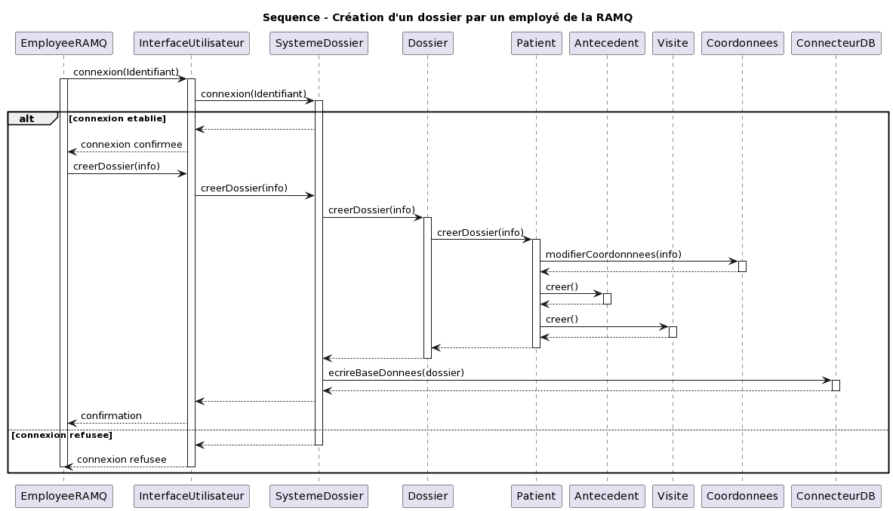
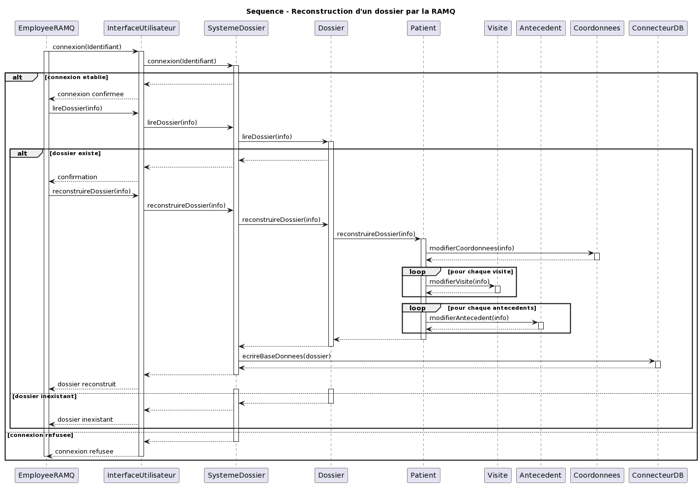

# Page de présentation

### Rapport 1

Remis dans le cadre du cours INF5153

Professeur: Gnagnely Serge Dogny

Membres de l'équipe:
- Vincent Bray
	BRAV20069009
- Lucas Poirier
	POIL20048805
- Alex Costa Soares
	SOAA01037905

Date de remise: 3 juillet 2022

# Table des matières

1. [Diagramme(s) de cas d'utilisation](#cas)

2. [Diagramme(s) de classe](#classe)

3. [Diagramme(s) de séquence](#sequence)

4. [Diagramme(s) de package](#package)

5. [Diagramme(s) de composants](#comp)

6. [Diagramme(s) de déploiement](#dep)

7. [Justifications GRASP](#grasp)

# Contenu

## Diagramme(s) de cas d'utilisation 
 
Le diagramme de cas d'utilisation représente les fonctionnalités offertes aux utilisateurs du système et précise quels utilisateurs ont accès à quelles fonctionnalités. Il devrait être noté que le patient, bien qu'il puisse lire son propre dossier, n'a pas accès à une vue complète de celui-ci. Aussi, il interagit avec le système de dossier avec des interfaces (app mobile, site web) qui sont différentes de celles utilisées par le personnel médical et le personnel de la RAMQ (app médecin).

## Diagramme(s) de classe 

### Explications

Nous avons commencé par constater que nous avions besoin d'une classe *Utilisateur*,  ainsi les différentes classes d'utilisateurs vont hériter de celle-ci et implémenter leurs comportements distincts. Le concept largement manipulé par le système nous semblait être un *Dossier*, nous l'avons donc représenté par une classe. Un *Dossier*, à notre sens, est constitué d'une liste de *Visite*, d'une liste d'*Antécédent* ainsi que des informations d'un patient. Chacun de ces concepts a donc été représenté sous forme de classes qui constituent un dossier. Nous avons aussi modélisé le concept de coordonnées et d'établissement sous forme de classe car ceux-ci impliquent plusieurs informations distinctes. Les établissements (ainsi que les patients) auront donc des coordonnées. Les visites, quant à elles, auront un établissement. Chaque *Etablissement* contient plusieurs *SalleEvaluation*, et chaque salle d'évaluation contient un ou plusieurs *PosteDeTravail*, auxquels sont assignés des *Medecin*, un exemple de respect de la loi de Demeter. Pour ce qui est de la documentation des changements, nous créons un nouveau dossier à chaque fois que celui-ci est modifié. Ces dossiers doivent être gérer par un *SystemeDossier* qui gère l'accès aux dossiers et les demandes de modification de ceux-ci faites par les utilisateurs. Le *SystemeDossier* utilise un *ConnecteurDB* pour faire les demandes d'écriture et de lecture à la base de données. Les utilisateurs interagissent tous avec un *InterfaceUtilisateur* pour envoyer des demandes au *SystemeDossier*. Le type d'interface varie selon le type d'utilisateur. Un seul des types d'utilisateur, l'employé RAMQ, a la capacité de créer des nouveaux dossiers. 

### Diagramme

## Diagramme(s) de séquence 

### Séquence pour la connection à un interface

 Dans les trois cas, le processus est le même: l'utilisateur
 entre ses identifiants dans l'interface utilisateur, qui 
 ensuite envoie une demande de connexion au *Systeme Dossier*. Celui-ci 
 envoie une demande de vérification des identifiants au connecteur BD,
 qui verifie la validité de ceux-ci et retourne un succès ou un échec.
 Le résultat est ensuite renvoyé au *Système Dossier* et finalement à
 l'interface utilisateur, qui affiche un message d'erreur ou connecte l'utilisateur,
 tout dépendant du resultat.

 ### Diagrammes

### Séquence pour la lecture d'un dossier

L'utilisateur va appeler sa méthode *lireDossier* avec un numéro de dossier en paramètre. Après avoir été acquis via la base de données, le *Dossier* en question va transformer toutes les informations qu'il contient en structure texte et retourner le tout pour que celui-ci puisse être affiché.

### Diagramme

### Séquence de modification du dossier d'un patient

Il s'agit ici de la séquence de modification du dossier d'un patient par un médecin dans le dossier du patient. Le médecin accède au dossier du patient par le logiciel de gestion (par exemple) avec le numéro d'assurance maladie du patient. Ayant obtenu les informations du dossier, il fait la demande de modification du dossier dans le dossier du patient. À la suite de quoi la méthode modifier() est appelée sur le dossier. Ensuite, les instances d'antécédents, de visites et de coordonnées ainsi que les informations du patient sont modifiés/créés au besoin. Suite à un enregistrement des modifications dans la base de données, une confirmation de la modification est finalement acheminée à l'utilisateur.

### Diagramme

### Séquence de modification des coordonnées

Il s'agit ici de la séquence de modification des coordonnées d'un patient par celui-ci. Le patient accède au dossier à travers le site web avec son numéro d'assurance maladie. Ayant obtenu les informations du dossier, il fait la demande de modification des coordonnées dans le dossier du patient. Le système accède a l'objet *Patient* pour pouvoir accèder à l'objet *Coordonnées* et en modifier le contenu. Suite à un enregistrement des modifications dans la base de données, une confirmation de la modification est finalement acheminée à l'utilisateur.

### Diagramme

### Diagramme de séquence de la création d'un dossier par un employé de la RAMQ

### Explications

Dans cette séquence, on a un employé de la RAMQ qui tente de se connecter au
système avec son identifiant à travers un interface utilisateur. Dans le cas
d'un refus, l'employé reçoit un message d'une connexion refusée. Dans le cas
d'une connexion acceptée, l'employé de la RAMQ utilise l'interface utilisateur
pour créer un dossier à partir d'informations qu'il possède. Par la suite, le
système de dossiers crée un dossier d'un patient. Un patient a des coordonnées
lors de la création d'un dossier mais n'a pas d'antécédents ni de visites lors
de la création du dossier (antécédent et visite sont des listes vides). Ensuite,
le dossier est écrit dans une base de données. Enfin, un message de confirmation
est envoyé à l'employé de la RAMQ par l'entremise de l'interface utilisateur.

### Diagramme

### Diagramme de séquence de la reconstruction d'un dossier par un employé de la RAMQ

### Explications

Dans cette séquence, on a un employé de la RAMQ qui tente de se connecter au système avec son identifiant à travers un interface utilisateur. Dans le cas d'un refus, l'employé reçoit un message d'une connexion refusée. Dans le cas d'une connexion acceptée,  l'employé de la RAMQ utilise l'interface utilisateur pour lire le dossier d'un patient. Si le dossier du patient n'existe pas, un message lui est envoyé de l'inexistence du dossier et l'employé doit suivre la séquence de création d'un dossier. Dans le cas où le dossier du patient existe, l'employé utilise l'interface utilisateur pour faire la requête de reconstruction d'un dossier à partir des informations qu'il possède (à partir d'une date par exemple). Le système se charge de la création du dossier en communiquant avec *Dossier* et *Patient* qui se chargent de la modification des coordonnées, des visites et des antécédents. Par la suite, le dossier est écrit dans une base de données. Enfin, un message est envoyé à l'employé de la RAMQ par l'entremise de l'interface utilisateur que le dossier est reconstruit.

### Diagramme 

## Diagramme(s) de package 

### Explications

Nous avons décidé de couper notre programme en plusieurs couches. Chacune de ces couches sera encapsulée dans son propre package. Ceci nous permet de réutiliser/réusiner une couche pour l'utiliser dans une autre conception plus tard. Nous avons une couche de présentation qui contient les objets que nous utiliserons pour intéragir avec les différentes applications (web, mobile) du système. La logique d'affaire du programme se trouve dans la couche logique. Dans la couche données, nous avons mis la classe qui servira de connecteur à la base de données du système.

### Diagramme

## Diagramme(s) de composants 

### Explications

Les utilisateurs ont accès à plusieurs interfaces d'utilisation pour accéder au *SystemeDossier*. Celui-ci gère les requêtes des utilisateurs et fait les appels à la BD. Chaque interface utilise un medium d'interaction différent et accorde des privilèges d'accès différents et ils doivent donc être distincts.

### Diagramme

## Diagramme de déploiement 

### Explications

Un diagramme de déploiement est une représentation de la topologie des composantes physiques d'un système et les liens de communications entre ces composantes. Elle sert à donner un portrait général du matériel d'un système que l'on veut représenter. Dans notre cas, nous avons des patients qui accèdent à leur dossier par l'entremise d'un navigateur web à partir d'un PC ou par l'entremise d'une application mobile d'un téléphone mobile. Nous avons également des professionnels médicaux ( des médecins ou autres) et des employés de la RAMQ qui accèdent au système par un logiciel de gestion installé sur un ordinateur.  Les PC, téléphones mobiles et ordinateurs sont connectés à
internet et communiquent avec un serveur web (la couche présentation). Celui-ci communique avec un serveur application (couche logique) qui se charge de la communication avec une base de données SQLite3.

### Diagramme

## Justifications GRASP 

### Patron Contrôleur

Dans nos couches de présentation nous utilisons le patron de contrôleur dans le cadre d'un modèle MVC (Modèle/Vue/Contrôleur). Le contrôleur, propre à chacune des couches, coordonne les messages externes sans se coupler aux objets internes.

### Patron Polymorphisme

Nos sous-classes de la classe abstraite *Utilisateur*, *InterfaceUtilisateur* et *Etablissement* utilisent le patron de polymorphisme. Nous pouvons ainsi leur donner des comportements différents lorsque la même fonction est appelée sur les classes ainsi que dans les divers contextes d'utilisation.

### Patron Spécialiste de l'information

Nous utilisons le patron de spécialiste de l'information pour la plupart de nos classes. Elles s'occupent de faire les opérations concernant les données qu'elles encapsulent.

### Patron Créateur

Pour la majorité des classes qui contiennent des objets issus d'autre classes (aggrégations, références), nous utilisons le patron de créateur. La classe contenant les objets est donc responsable de les créer. Un bon exemple de ceci serait notre classe *Dossier*, qui construit les objets de type *Antécédent*, *Visite* et *InfoPatient*.

### Patron Forte cohésion

Nous utilisons le patron forte cohésion dans notre conception. Ainsi, plusieurs de nos classes peuvent être utilisées à des fins que nous n'avons pas prévus. Par exemple, la classe *Coordonnées* peut être utiliser pour représenter des coordonnées autres que celle d'établissements ou de patients.

### Patron Faible couplage

Nous utilisons le patron de faible couplage dans notre conception. Ainsi, nous minimisons les dépendences entre les objets afin de réduire l'impact des changements.

### Patron protégé des variations

Nous utilisons le patron protégé des variations dans notre conception. Nous avons identifié les comportements de lecture et de modifications et les avons encapsulé dans deux interfaces que plusieurs de nos objets peuvent implémenté.
